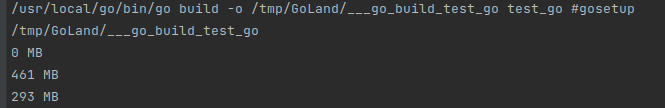
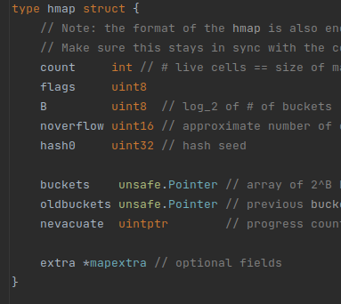

Như các bạn đã biết thì map là một data type được dựng sẵn trong Golang và nó là một tập hợp các cặp key/value.</br>
Nghe thì thấy khá đơn giản nhỉ, khi cần thì add record vào map, còn không cần nữa thì xóa đi. </br>
Ủa, đơn giản như vậy mà lại còn được buildin nữa thì sao lại dẫn đến leak memory được, đây là mind set của mình khi mới dùng Go đấy</br>
Không dài dòng nữa, mình sẽ đưa ví dụ luôn.

## 1. Tình huống

```
package main 

import (
	"runtime"
	"fmt"
)

func main() {
    // Init
    n := 1_000_000
    m := make(map[int][128]byte)
    printAlloc()
    
    // Add elements
    for i := 0; i < n; i++ {
    m[i] = randBytes()
    }
    printAlloc()
    
    // Remove elements
    for i := 0; i < n; i++ {
    delete(m, i)
    }
    
    // End
    runtime.GC()
    printAlloc()
    runtime.KeepAlive(m)
}

func randBytes() [128]byte {
    return [128]byte{}
}

func printAlloc() {
    var m runtime.MemStats
    runtime.ReadMemStats(&m)
    fmt.Printf("%d MB\n", m.Alloc/1024/1024)
}
```

1. Đầu tiên chúng ta sẽ cấp phát memory, khởi tạo empty map m 
2. Tiếp theo đó loop 1 triệu lần để gắn elelemt cho m
3. Cuối cùng là remove tất cả elements trong m và chạy GC

Sau mỗi bước trên, chúng ta sẽ log size của heap memory bằng runtime.MemStats (MemStats records statistics about the 
memory allocator).</br>
Dòng cuối cùng **runtime.KeepAlive(m)** để giữ lại reference tới map m không bị thu gom bởi GC.</br>
Oke, chạy chương trình nào, cùng dự đoán nhé!!



Woww, kết quả này có giống như dự đoán của các bạn không?

Sau khi cấp phát memory cho map m, heap size là nhỏ nhất - 0 MB.
Sau đó heap size tăng nhanh chóng khi add 1 triệu element vào map m. Cuối cùng, mặc dù GC đã thu gom hết các element bị
xóa khỏi map, 
nhưng heap size vẫn là 293 MB. Heap memory size đã giảm nhưng không như chúng ta mong muốn là 0 MB, right? Vậy đâu 
là nguyên do?.

## 2. Nguyên nhân là do đâu?
Trước khi tìm ra nguyên do, chúng ta cần phải biết cách map hoạt động trong golang.

Về cơ bản, Map trong Go là 1 con trỏ đến runtime.hmap, struct hmap này chứa rất nhiều field, trong đó có B field là 
thể hiện số lượng bucket hiện có trong map.
Mỗi bucket này lại là pointer tới array (mỗi array chỉ có 8 phần tử, khi hết thì tạo thêm array mới và link với 
array trước) chứa các element của map. Nên khi chúng ta thêm element vào map, thì nghĩa là chúng ta đang thêm element vào 
bucket. Tương tự như lúc xóa cũng vậy. </br>
Mình sẽ để link ở đây cho bạn nào muốn tìm hiểu kỹ hơn về phần này: https://dave.cheney.net/2018/05/29/how-the-go-runtime-implements-maps-efficiently-without-generics



Nhưng có một điều lưu ý ở đây là khi thêm elemenet vào map, số lượng bucket sẽ được cấp phát và tăng lên, element 
được thêm vào bucket, nhưng khi tiến hành xóa element
trong map, thì chúng ta chỉ xóa element trong bucket đấy thôi chứ sẽ không xóa số lượng bucket được cấp phát trước đó.

Như trong cuốn sách [100 Mistakes In Golang](https://www.amazon.com/100-Mistakes-How-Avoid-Them/dp/1617299596) ở 
page 88, tác giả đưa ra con số bucket là 262,144 buckets khi thêm 1 triệu element vào, và khi xóa đi thì số lượng 
bucket vẫn là 262,144.

=> Kết luận: Số lượng bucket trong map chỉ tăng lên chứ không giảm đi. Và đây chính là nguyên nhân dẫn đến số lượng 
heap size giảm không đúng theo expected của chúng ta. Vì GC chỉ thu gom 
những element đã được xóa trong bucket chứ không tác động lên map.

## 3. Đây có thực sự là vấn đề?
Theo quan điểm của mình thì việc các buckets này không bị xóa đi khi element bị xóa cũng chưa hẳn là xấu.
Tốt hay xấu thì cũng phải tùy từng tình huống.

Nếu map của các chúng ta chứa element mà không cần CUD thì tất nhiên sẽ không gặp vấn đề này.</br>
Còn nếu map chứa element thường xuyên phải insert và delete thì tất nhiên sẽ gặp vấn đề này. Nhưng trong tình huống 
này cũng có cái tốt và cái xấu. Khi chúng ta xóa element đi rồi lại thêm element mới vào thường xuyên, thì các bucket
trong map vẫn giữ nguyên, hệ thống sẽ không cần phải cấp phát lại bucket nữa, qua đó sẽ tăng performance xíu xíu cho 
hệ thống :v. Còn mặt xấu thì các bạn thấy rồi đấy, memory sẽ không giảm đúng theo expected của chúng ta, 
dev mà không có kinh nghiệm về mảng này là mò hoài không ra lý do tại sao Mem cứ tăng mà giảm xíu xíu, xong rồi lại 
bị sếp đè đầu hỏi =))) 

Trong thực tế thì case này rất dễ xảy ra, ví dụ khi hệ thống của bạn sử dụng map để lưu data cache của user, vào các ngày khuyến mại
lớn như 1/1, có hàng triệu triệu người dùng vào website mua sắm. Nhưng sau đó vài ngày, bạn vẫn thấy lượng Mem của server ở
mức cao mà không hề giảm, thế là ông sếp lại đè đầu bạn ra để trừ lương :v.

Cách đây vài tháng, mình cũng từng gặp case như vậy, mình làm freelance cho một công ty về mảng live stream, nội dung 
giải trí, truyền hình trực tuyến.
Họ dùng cache local để lưu lại data của người dùng và toàn bộ thông tin về danh mục xem của mỗi người dùng (cái data 
này to vcl lun). Xong mỗi lần chạy 
load testing cái là memory của server nó tăng như tên lửa, không giảm tý nào luôn. Sếp mình lúc đấy chắc cũng bế tắc, 
thế là đá cái task đấy cho mình, bảo mình nghiên cứu xem sao mem k giảm =)). Mình lúc đấy 
là thằng sv mới ra truường thì có biết gì đâu. Ngồi nghiên cứu cả tháng trời mà 
không có báo cáo gì. Kết quả là gì thì các bạn cũng đoán được rồi đấy =))) 

## 4. Giải pháp

Giải pháp đơn giản nhất là reset service rồi, nhưng chúng ta đâu thể tự reset đúng không, lại phải ới ông devops bảo
"Alo a ơi, a reset con service X hộ e với". Gặp ông devops dễ thì không sao, chứ gặp ông khó tính thì dời ơi đất hỡi lắm.
Mà reset một lần thì có thể không sao, chứ reset nhiều lần trong 1 tháng thì mình nghĩ chắc cũng sắp nghỉ việc rồi đấy =)) 

Giải pháp tiếp theo là tạo lại map đó. Giả sử chúng ta chạy 1 goroutine, cứ mỗi 1 tiếng thì nó lại copy tất cả element trong 
map cũ và thêm vào map mới, xong replace map cũ là xong. Nhưng cái này cũng có nhược điểm, sau khi copy tất cả elements sang map mới
thì mem của chúng ta vẫn tồn tại map cũ cho đến khi GC lần tiếp theo thu gom.

Một giải pháp khác là chúng ta lưu trữ con trỏ trỏ đến data, chứ không lưu trực tiếp data trong map. Nó không xử lý được vấn đề
về số lượng bucket không giảm, nhưng nó sẽ giảm kích thước phải lưu trữ trong bucket.

## 5. Summary
Chúng ta cần phải chú ý khi dụng map trong golang nếu không muốn những tháng ngày debug không lối thoát :v.
Các bạn nên cân nhắc xem tình huống này có sử dụng map được không, và nếu sử dụng thì sẽ gặp vấn đề gì khi số lượng 
element trong map phình to. Và cuối cùng là phải ghi nhớ: **"Go map can only grow in size, there is not automated strategy to shrink it."**

P/s: </br>
Đây là lần đầu tiên mình viết bài chia sẻ kiến thức, và kinh nghiệm của mình vẫn còn khá ít, chủ yếu là trên sách vở,
sẽ không thể tránh được những sai lầm. Nhưng mình luôn luôn có mong muốn được chia sẻ những kiến thức mà mình biết đến
với mọi người, đặc biệt là gopher :v. Nên mình rất mong muốn có những phản hồi đóng góp chia sẻ của các độc giả để các bài sau 
mình có thêm động lực để viết tốt hơn. Thanks for everyone !!!!

## 6. References
https://dave.cheney.net/2018/05/29/how-the-go-runtime-implements-maps-efficiently-without-generics

Harsanyi, T. (2022) 100 go mistakes. Shelter Island: Manning Publications.

