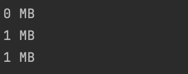
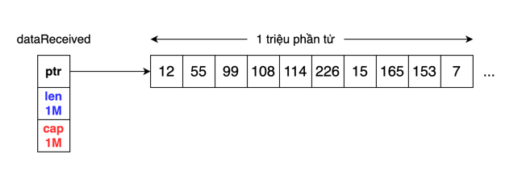
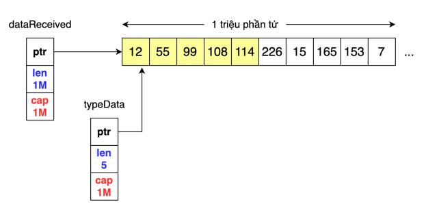
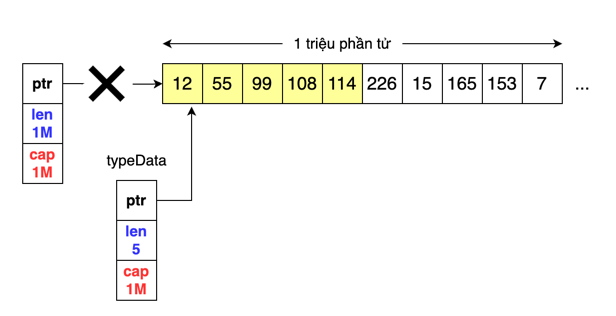
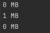
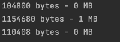

Chào mừng các bạn đã quay trở lại với series những common mistakes trong Golang. Trong bài này, chúng ta sẽ tìm hiểu về
nguyên nhân gây ra memory leak liên quan đến slice, array trong Go. Không giống như C/C++, Go có GC, vì thế chúng ta không
cần quan tâm đến memory allocation hay release. Tuy nhiên, chính vì có sự giúp đỡ của GC mà chúng ta cần hiểu cách GC hoạt động
để phòng tránh những trường hợp vô ý gây ra memory leak. Và trong bài này, chúng ta sẽ tìm hiểu về leaking memory do sử dụng
slicing slice.

## 1 Scenario

Giả sử chúng ta có một service consumer, service này sẽ nhận data dưới dạng slice, 5 vị trí đầu của slice là type của data.
Service sẽ lấy 5 phần tử đầu tiên của data để thực hiện một số chức năng. 

Dưới đây sễ là ví dụ đơn giản.

```
package main

import (
	"fmt"
	"runtime"
)

func main() {
	// Start
	printAlloc()
	
	dataReceived := make([]byte, 1024*1024) // Giả sử mình nhận được data slice có dung lượng là 1 MB
	printAlloc()

	typeData := getTypeOfData(dataReceived) // Lấy 5 phần tử đầu tiên của data
	// Do something with typeData
	// storeTypeDataInCache(typeData)

	runtime.GC()                // Chạy GC thu gom
	runtime.KeepAlive(typeData) // Giữ lại typeData variable
	printAlloc()
	// End
}

func getTypeOfData(data []byte) []byte {
	return data[:5] // thực hiện slicing slice
}

func printAlloc() {
	var m runtime.MemStats
	runtime.ReadMemStats(&m)
	fmt.Printf("%d MB\n", m.Alloc/1024/1024)
}
```

- Ở đây để đơn giản thì mình sẽ khởi tạo **dataReceived** với dung lượng 1MB (Các bạn cứ hình dung là chúng ta nhận được
1MB data từ request hoặc service khác nhé :v).
- Sau khi nhận được **dataReceived**, mình sẽ tiến hành lấy 5 phần tử đầu tiên của slice bằng cách slicing như code trên.
- Cuối cùng mình sẽ dun **runtime.KeepAlive** để giữ **typeData** không bị thu gom bởi GC, để minh họa cho việc mình sẽ lưu
**typeData** vào memory cache của chương trình.
- Sau mỗi bước mình sẽ print memory stack của process để xem hiện tại process tiêu tốn bao nhiêu dung lượng.

Code không có vấn đề gì và khá dễ hiểu nhỉ. Trước khi chạy chương trình thì các bạn hay đoán xem dung lượng memory stack
khi start và end là bao nhiêu nhé. Theo lý thuyết thì dataReceived có khoảng 1 triệu phần tử thì chiếm 1MB memory, typeData
có 5 phần từ thì chiếm  khoảng 5 byte he. Chạy chương trình xem có đúng vậy không nào.



Âu shit, memory stack lúc nhận data và sau khi GC thu gom là giống nhau. Vậy không phải là 5 byte như chúng ta dự đoán.
Vậy có nghĩa là **typeData** đang giữ dung lượng là 1MB?  Thế này nếu service nhận 1 nghìn data giống như này, thì memory
nó cần tận 1GB lận. Đến đây có thể các bạn sẽ nghĩ rằng một là code có vấn đề, hai là giả định của chúng ta ở trên là sai.
Vậy chúng ta cùng tìm hiểu nguyên nhân là tại sao.

## 2. How slice work
Trước tiên, chúng ta cần hiểu cách slice hoạt động.

Slice trong Golang là fat pointer. Các bạn có thể đọc ở bài viết [này](https://nullprogram.com/blog/2019/06/30/)  để hiểu hơn về fat pointer.
Cấu trúc của slice bao gồm:
```
type  SliceHeader  struct {
    Data  uintptr  // đỉa chỉ trong bộ nhớ của con trỏ trỏ tới underlying array của slice. 
    Len   int      // độ dài của slice.
    Cap   int      // kích thước tối đa mà vùng nhớ trỏ tới slice được cấp phát.
}
```

Về cơ bản, các bạn có thể hiểu là khi chúng ta có một slice thì nghĩa là chúng ta đang có một pointer trỏ tới underlying
array của slice đấy.

## 3. Reason

Sau khi hiểu cách slice hoạt động, chúng ta cùng quay lại để visualize vấn đề ở trên nào.

**dataReceived** khi init, các bạn có thể hình dung nó như này. 1 array gồm 1 triệu elements
sẽ được cấp phát ở memory stack, và dataReceived sẽ trỏ pointer tới đó. 



Sau đó, chúng ta tạo thêm 1 slice **typeData**  từ slice **dataReceived**  bằng phương pháp slicing. Khi sử dụng phương pháp
slicing thì thay vì tạo ra một underlying array mới thì Go sẽ trỏ pointer vào underlying array có sẵn đó như hình dưới đây.
Khi đó, **typeData** của chúng ta mặc dù chỉ có 5 phần tử nhưng capacity của nó là 1M phần tử.


Cuối cùng khi process kết thúc.



Chúng ta keepAlive **typeData**, còn **dataReceived** sẽ được thu gom bởi GC. Nhưng vì
underlying array của **dataReceived** vẫn đang được **typeData** trỏ tới, nên GC sẽ không thu gom nó, mà nó vẫn sẽ
tồn tại trong memory cho đến khi nào mà không còn slice nào trỏ đến nó. Và đây chính là lý do tại sao sau khi process
kết thúc mà chúng vẫn thấy có 1MB tồn tại trong memory. Vậy giải pháp của vấn đề này là gì?

## 4. Solution
Ở trên 2 slice cùng trỏ vào một underlying array, vậy nếu giờ chúng ta tách 2 slice đó thành 2 underlying array riêng biệt
thì sẽ giải quyết được vấn đề. Khi đó GC sẽ thu gom hoàn toàn **dataReceived** và chỉ giữ lại **typeData**.

Để triển khai giải pháp này, chúng ta sẽ dùng phương pháp copy slice thay vì slicing slice như trước.

Bởi vì chúng ta dùng phương pháp copy, **typeData** sẽ có độ dài là 5 và capacity là 5 thay vì 1M, lưu trữ 5 bytes 
trong memory thay vì 1MB như trước đó.

Sửa lại function **getTypeOfData** nào.
```
func getTypeOfData(data []byte) []byte {
	dataType := make([]byte, 5)
	copy(dataType, data)
	return dataType
}
```

Chạy lại và xem kết quả.



Kết sau khi chúng ta update code là 0 MB. Đây là do function printAlloc() của mình đã chia dung lượng bytes cho 1024*1024 để
convert dung lượng sang MB nên nó sẽ làm tròn số float. Mình sẽ sửa lại hàm lại 1 chút để cho nó print
dung lượng bytes.

```
func printAlloc() {
	var m runtime.MemStats
	runtime.ReadMemStats(&m)
	fmt.Printf("%d bytes - %d MB \n", m.Alloc, m.Alloc/1024/1024)
}
```

Chạy lại chúng ta sẽ nhận được kết quả. 



Khi process khởi tạo, memory là 104800 bytes, và sau khi process kết thúc, memory là 110408 bytes, chênh lệch khoảng
5608 bytes :D. Và ở trong 5608 bytes này sẽ tồn tại 5 bytes của chúng ta lưu trữ **typeData**. Bởi vì khi chạy chương trình
sẽ có thêm những phần được khởi tạo và cấp phát memory ở bên dưới mà chúng ta không nhìn thấy nên con số memory sẽ có chút
chênh lệch. Nhưng thật vui khi thấy dung lượng memory không còn là 1MB như trước đúng không nào :v.
## 5. Recap

Tóm lại, hãy nhớ rằng khi slicing một slice hoặc array có dung lượng lớn có thể dẫn đến leaking memory. Underlying array
sẽ không được GC thu gom khi vẫn có pointer trỏ tới. Và chúng ta có thể giữ lại underlying array rất lớn trong memory trong
khi chỉ sử dụng vài element của underlying array đó. Và copy slice là giải pháp để phòng tránh trường hợp này.

## 6. References
Harsanyi, T. (2022) 100 go mistakes. Shelter Island: Manning Publications.

